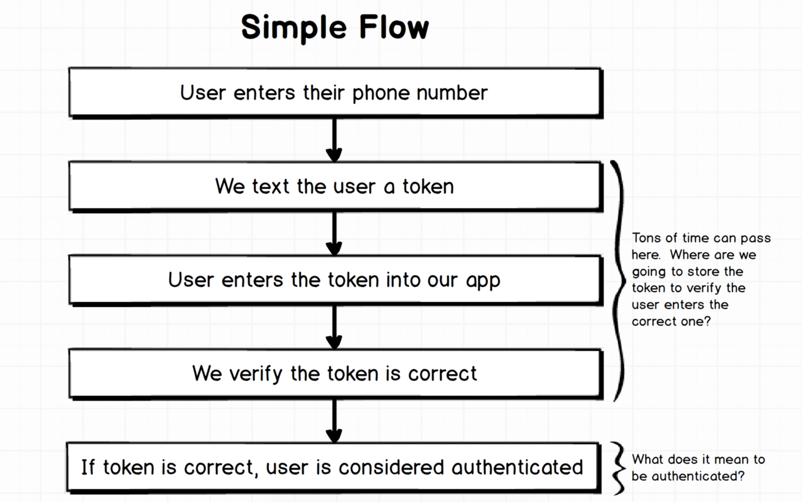
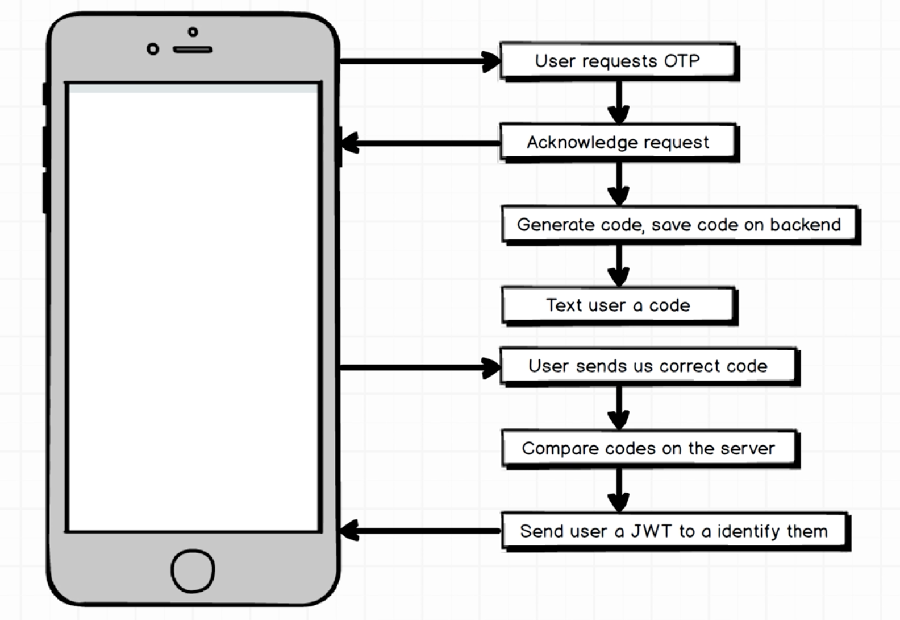

# one-time-password-react-native

### Description
I will be building a one time password authentication using React Native.

### Tech Stack
* **React Native:** show user a form to sign-up and sign-in.
* **Twillo:** send text messages to users.
* **Firebase:** store user data, including user accounts and correct one-time password codes.
* **Google Cloud Function:** tiny bits of code that run one time on demand. Has access to data in Firebase.

### User Flow and Approach
* Basic user flow

* Best Approach

* Handling a New User
*Cloud function #1*
1. User enters email and phone
2. Verify phone is not in use
3. Create a new user record in Firebase
*Cloud function #2*
4. User requests to log-in with phone number
5. Generate code
6. Save the code to the user's record
7. Text the code to the user
*Cloud function #3*
8. User enters code
9. Compare codes
10. Mark code as no longer being valid
11. Return a JWT (JSON Web Token) to user
### Source
[Stephen Grider's React Native](https://www.udemy.com/react-native-advanced)
